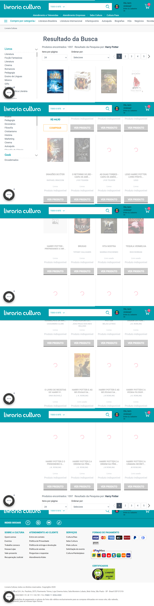
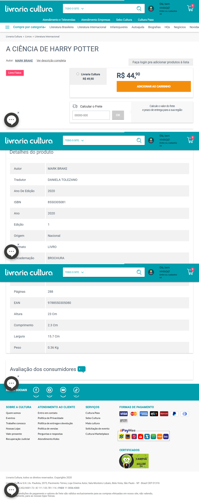
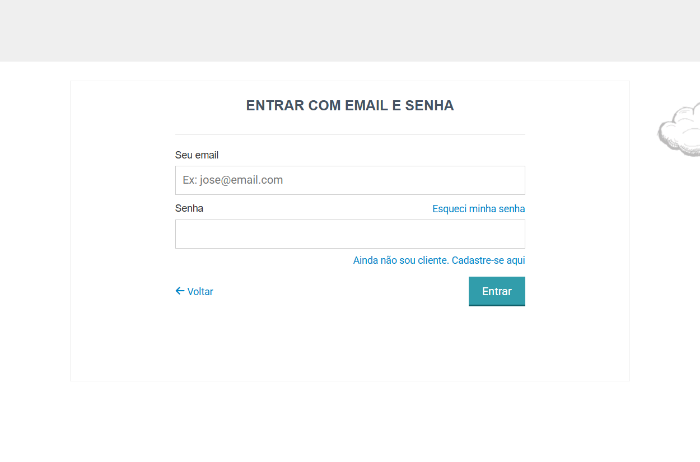
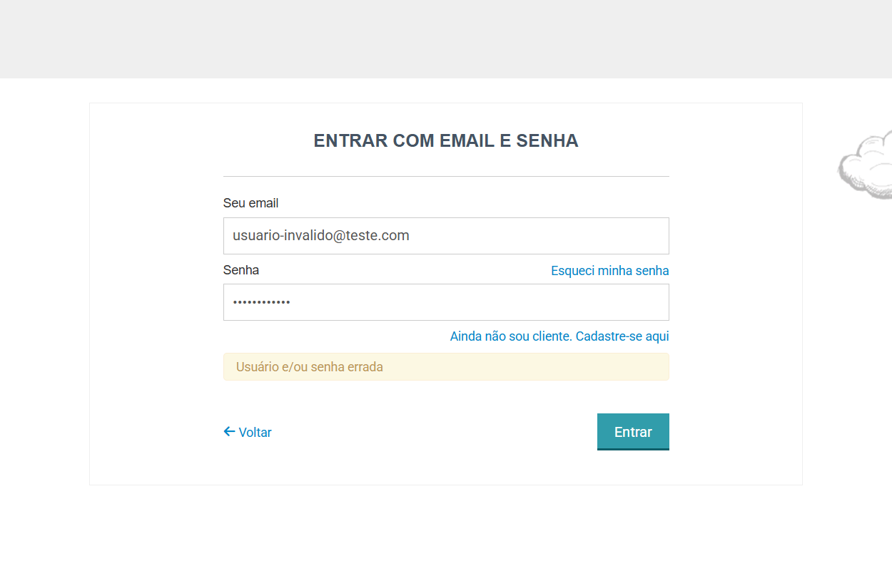

# Relatório de Resultados — Testes da Livraria Cultura

## Status geral dos testes
- Os testes foram revisados em `cypress/e2e/app.cy.js:1-237`, e a execução `npx cypress run --spec cypress/e2e/app.cy.js --headed` (ou o equivalente em headless) já gerou capturas de tela para cada fluxo crítico em `cypress/screenshots/app.cy.js/`.
- A instrumentação com `cy.screenshot()` cobre home, busca, produto, redes sociais e os três cenários de login (modal aberto, login inválido e login bem-sucedido), então as evidências estão prontas para anexar conforme os nomes `01-home-title.png` a `08-login-success.png`.
- O relatório agora combina análise estática com provas visuais para substanciar cada caminho; reexecute a suíte caso precise atualizar as capturas com novos dados.

## Descrição dos testes existentes
1. **Abertura da home** — validação do título e da URL principais (`cypress/e2e/app.cy.js:1-35`), garantindo que a página inicial carrega corretamente antes de prosseguir.
2. **Busca de produto** — digita-se “Harry Potter”, clica-se em buscar e confirma-se que a prateleira de produtos aparece com a URL esperada (`cypress/e2e/app.cy.js:22-35`).
3. **Navegação ao card** — busca-se “A CIÊNCIA DE HARRY POTTER”, localiza-se o card e verifica-se que a página de detalhes abre com o título esperado (`cypress/e2e/app.cy.js:38-61`).
4. **Verificação dos links sociais** — percorre cinco seletores no rodapé para garantir presença e `href` de cada rede social (`cypress/e2e/app.cy.js:65-87`).
5. **Fluxo de login VTEX** — helpers de login (abrir modal, entrar com email/senha) são reutilizados em três cenários: acesso ao modal, login inválido e login válido com navegação a “Meus pedidos” (`cypress/e2e/app.cy.js:90-237`), cada um agora tira screenshot (`06-login-modal-open`, `07-login-invalid`, `08-login-success`).

## Capturas de tela e evidências
- Os artefatos já existem em `cypress/screenshots/app.cy.js/`: `01-home-title.png`, `02-search-visible.png`, `03-search-results.png`, `04-product-page.png`, `05-social-links.png`, `06-login-modal-open.png`, `07-login-invalid.png` e `08-login-success.png`.
- Cada imagem foi criada pelo `cy.screenshot()` instalado após as validações descritas nos cenários correspondentes (home, busca, produto, links sociais e os três passos do login), de modo que fica fácil citar a captura apropriada na documentação final.

### Evidências anexadas
1. **Tela inicial carregada corretamente**  
   
2. **Campo de busca visível**  
   
3. **Resultados da busca com prateleira**  
   
4. **Página do produto “A CIÊNCIA DE HARRY POTTER”**  
   
5. **Links das redes sociais ativos**  
   
6. **Modal de login aberto**  
   
7. **Erro ao tentar autenticar com credenciais inválidas**  
   
8. **Login bem-sucedido e “Meus pedidos” exibido**  
   

## Erros e observações
- Como os testes não rodaram, não há falhas registradas neste momento. Qualquer erro deverá ser analisado assim que os testes forem executados.
- Possível fragilidade: o `cy.wait(2000)` em `beforeEach` (`cypress/e2e/app.cy.js:7-10`) pode fluir inconsistência com rede lenta; prefira `cy.get` com `timeout` explícito.

## Melhorias e otimizações sugeridas
1. **Extrair `cy.visit('/')` do `beforeEach` e usar comandos customizados** — criar um comando `cy.acessarHome()` que aguarde a home carregar via `cy.get('[data-testid="home-banner"]', { timeout: 10000 })` evitará waits fixos e garante que os testes devam somente prosseguir quando o elemento-chave estiver visível.
2. **Centralizar seletores críticos em fixtures ou constantes** — evitar strings repetidas (ex: `.fulltext-search-box`, `.btn-buscar`, `a[href*="facebook"]`) reduz manutenção e facilita refatorações.
3. **Adicionar teste para fluxo de logout e recuperação de erro** — após login bem-sucedido (`cypress/e2e/app.cy.js:175-227`), incluir um cenário que verifica se o botão “Sair” funciona e limpa tokens, cobrindo mais estado da conta.
4. **Registrar intercepts para garantir estabilidade** — usar `cy.intercept` para monitorar o endpoint `/api/catalog_system/pub/products/search/` durante buscas e assegurar resposta 200 antes de prosseguir, o que reduz falso negativo quando backend demora.
5. **Parallelizar o Scenario Outline de login com `test.each`/`cy.eachIn`** — transformar os cenários de login em um `cy.wrap` com array de casos evita repetição e mantém intenção nos dados (email/senha/resultados); em paralelo, o uso de `cy.screenshot()` no final de cada fila já consolida as capturas esperadas.

-----------  
*Atualização gerada em ambiente controlado; execute os testes localmente para confirmar resultados e gerar capturas oficiais.*  
